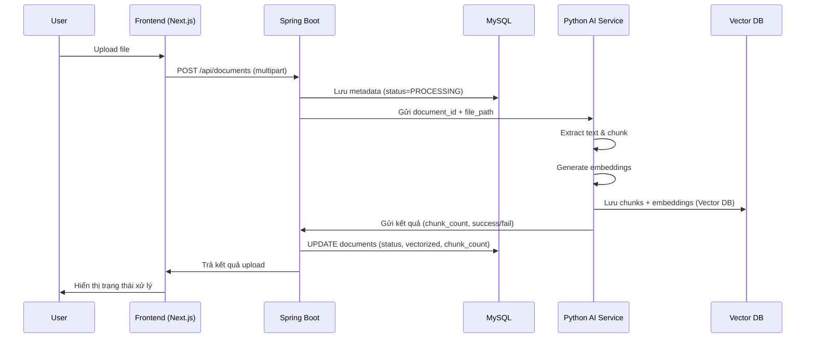
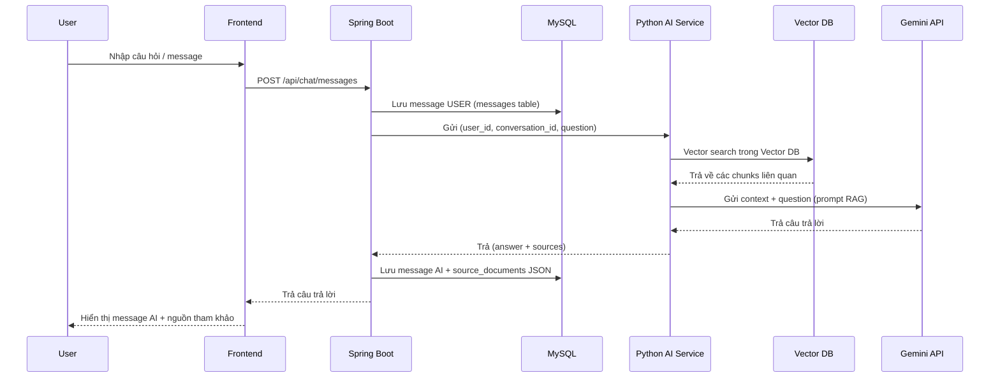
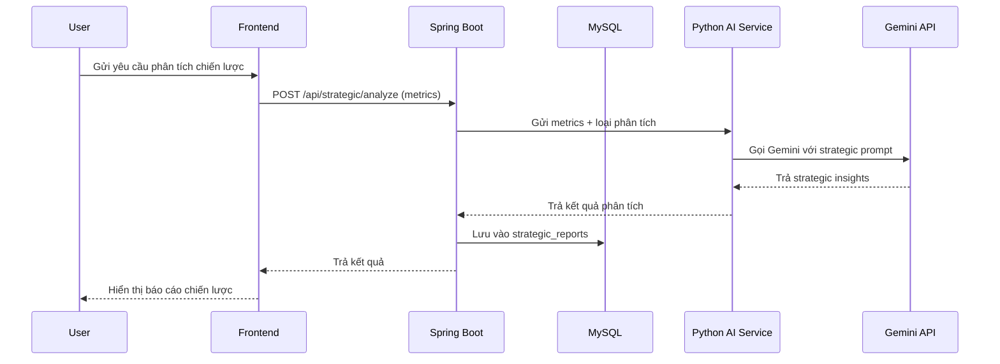

# 🤖 AI Agent for Business

> **Đồ Án Chuyên Ngành - Đại Học Trà Vinh**
>
> Hệ thống AI thông minh hỗ trợ doanh nghiệp trong việc bans hang chăm sóc khách hàng, tư vấn sản phẩm và đề xuất chiến lược kinh doanh dựa trên dữ liệu nội bộ.
>
> **Sinh viên thực hiện:** Nguyễn Văn Hoàng  
> **MSSV:** 110122078  
> **Khoa:** Công Nghệ Thông Tin  
> **Trường:** Đại Học Trà Vinh  
> **Giáo viên hướng dẫn:** ThS. TS. Nguyễn Bảo Ân

[](https://spring.io/projects/spring-boot)
[](https://nextjs.org/)
[](https://fastapi.tiangolo.com/)
[](https://www.python.org/)
[](https://openjdk.org/)

---

## 📋 Mục Lục

- [Tổng Quan](#-tổng-quan)
- [Kiến Trúc Hệ Thống](#-kiến-trúc-hệ-thống)
- [Thành Phần Chính](#-thành-phần-chính)
- [Chức Năng Chi Tiết](#-chức-năng-chi-tiết)
- [Luồng Hoạt Động](#-luồng-hoạt-động)
- [Công Nghệ Sử Dụng](#-công-nghệ-sử-dụng)
- [Cài Đặt & Chạy Dự Án](#-cài-đặt--chạy-dự-án)
- [Cấu Trúc Thư Mục](#-cấu-trúc-thư-mục)
- [API Documentation](#-api-documentation)
- [Đóng Góp](#-đóng-góp)

---

## 🎯 Tổng Quan

**AI Agent for Business** là một hệ thống AI đa chức năng được thiết kế để:

- 💬 **Chăm sóc khách hàng tự động** với chatbot thông minh
- 📚 **Tư vấn sản phẩm** dựa trên knowledge base nội bộ
- 📊 **Phân tích và đề xuất chiến lược kinh doanh** từ dữ liệu thực tế
- 🔍 **Tìm kiếm thông minh** với RAG (Retrieval-Augmented Generation)
- 📈 **Báo cáo tự động** với insights dựa trên AI

### Điểm Nổi Bật

✅ **Tách bạch rõ ràng hai tầng dữ liệu**:
- MySQL: dữ liệu cấu trúc (users, documents metadata, conversations, reports, logs)
- Vector DB: embeddings + text chunks cho RAG, chỉ do Python AI Service truy cập

✅ **Kiến trúc đa service**: Frontend (Next.js) – Backend (Spring Boot) – AI Service (FastAPI)  
✅ **RAG-Powered**: Kết hợp tìm kiếm vector với Gemini AI  
✅ **Real-time Communication**: Hỗ trợ real-time chat (WebSocket hoặc long-polling tuỳ cấu hình)  
✅ **Đa định dạng**: Xử lý PDF, DOC/DOCX, TXT, Excel, CSV  
✅ **Scalable & Secure**: JWT authentication, RBAC, Redis caching  

---

## 🏗️ Kiến Trúc Hệ Thống

```text
┌─────────────────────────────────────────────────────────────────┐
│                         USER INTERFACE                          │
│                     Next.js 14 + TypeScript                     │
└───────────────────────────┬─────────────────────────────────────┘
                            │
                            │  REST API / (WebSocket)
                            │
┌───────────────────────────▼─────────────────────────────────────┐
│                         BACKEND API                             │
│                  Spring Boot 3.x + Java 17                      │
│                                                                 │
│  - Quản lý người dùng, phân quyền (RBAC)                        │
│  - Quản lý tài liệu (metadata)                                  │
│  - Quản lý hội thoại & tin nhắn                                 │
│  - Quản lý báo cáo chiến lược                                   │
│  - Ghi log hoạt động                                            │
│  - Giao tiếp với AI Service (Python) qua REST                   │
└───────────┬───────────────────────────────┬─────────────────────┘
            │                               │
            │                               │ HTTP (internal)
            │                               ▼
   ┌────────▼────────┐            ┌───────────────────────────────┐
   │   MySQL 8.0     │            │        AI SERVICE             │
   │ (Structured DB) │            │   Python 3.11 + FastAPI       │
   │                 │            │   + Gemini API + RAG Engine   │
   └────────┬────────┘            │                               │
            │                     │  - Xử lý tài liệu: extract,   │
            │                     │    chunk, sinh embeddings     │
            │                     │  - Truy cập Vector DB         │
            │                     │  - Thực hiện RAG + gọi LLM    │
            │                     └───────────┬───────────────────┘
            │                                 │
            │                                 │
            ▼                                 ▼
   ┌────────────────┐               ┌────────────────────────────┐
   │  Redis Cache   │               │     Vector Database        │
   │ (sessions,     │               │ (ChromaDB/Qdrant, lưu      │
   │  caching)      │               │  embeddings + text chunks) │
   └────────────────┘               └────────────────────────────┘
```

> **Quan trọng:**
>
> * Spring Boot **chỉ kết nối trực tiếp MySQL + Redis**
> * Python FastAPI **kết nối trực tiếp Vector DB và (nếu cần) đọc một phần từ MySQL qua API**
> * Spring Boot KHÔNG trực tiếp query Vector DB, mà luôn gọi qua AI Service.

---

## 🧩 Thành Phần Chính

| Thành Phần     | Công Nghệ                 | Chức Năng Chính                                                              |
| -------------- | ------------------------- | ---------------------------------------------------------------------------- |
| **Frontend**   | Next.js 14 + TypeScript   | Giao diện người dùng, trang dashboard, quản lý tài liệu, màn hình chat       |
| **Backend**    | Spring Boot 3.x + Java 17 | Business logic, REST API, bảo mật, truy cập MySQL, ghi logs, gọi AI Service  |
| **AI Service** | Python 3.11 + FastAPI     | Xử lý RAG, sinh embeddings, gọi Gemini API, truy vấn Vector DB               |
| **MySQL**      | MySQL 8.0                 | Lưu users, roles, documents metadata, conversations, messages, reports, logs |
| **Vector DB**  | ChromaDB / Qdrant (gợi ý) | Lưu embeddings + text chunks, dùng cho semantic search & RAG                 |
| **Cache**      | Redis 7.x                 | Session management, caching dữ liệu đọc nhiều                                |

---

## 🔧 Chức Năng Chi Tiết

### 1. 📁 Module Quản Lý Tài Liệu (Spring Boot + FastAPI + Vector DB)

#### 1.1. Quản lý metadata tài liệu (Spring Boot + MySQL)

* Lưu metadata tài liệu vào MySQL:

  * Tên, loại file, kích thước, đường dẫn lưu trữ.
  * Người upload, category, tags.
  * Trạng thái xử lý: `PENDING`, `PROCESSING`, `COMPLETED`, `FAILED`.
  * Thông tin vector hoá: `vectorized`, `chunk_count`, `total_tokens`.
* Phân quyền truy cập:

  * Tài liệu của riêng user.
  * Tài liệu được chia sẻ cho user khác.
* API:

  * Upload tài liệu (Spring nhận file, lưu metadata, gọi AI Service xử lý).
  * Danh sách tài liệu theo quyền user.
  * Xem chi tiết metadata tài liệu.
  * Xoá/cập nhật metadata (theo role).

#### 1.2. Xử lý nội dung & embeddings (Python + Vector DB)

* Python AI Service nhận:

  * `document_id` + `file_path` từ Spring.
* Thực hiện:

  * Trích xuất text.
  * Chunk văn bản hợp lý.
  * Sinh embeddings (vector).
  * Lưu `documents`, `embeddings`, `metadatas` vào Vector DB.
* Cập nhật lại MySQL thông qua API hoặc query:

  * `status = COMPLETED / FAILED`
  * `vectorized = TRUE/FALSE`
  * `chunk_count`, `processed_at`.

> 👉 **Spring không trực tiếp lưu embeddings**, mọi vector hoá được xử lý & lưu bởi Python + Vector DB.

---

### 2. 💬 Module Chatbot Thông Minh (Spring Boot + FastAPI)

#### 2.1. Quản lý hội thoại & tin nhắn (Spring Boot + MySQL)

* Bảng `conversations`:

  * Lưu 1 phiên chat giữa user ↔ AI.
* Bảng `messages`:

  * Lưu từng tin nhắn (USER/AI).
  * `source_documents` (JSON): tài liệu/đoạn đã dùng để trả lời.

Backend Spring:

* Nhận message từ frontend.
* Tạo mới conversation hoặc dùng conversation hiện tại.
* Lưu message của user.
* Gọi API sang Python AI Service để lấy câu trả lời.
* Lưu message AI + nguồn (source documents) vào MySQL.
* Trả kết quả cho frontend.

#### 2.2. Hội thoại RAG (Python AI + Vector DB)

**Luồng xử lý chuẩn (đã cập nhật):**

```text
1. User gửi câu hỏi → Spring Boot
2. Spring Boot lưu message USER vào MySQL
3. Spring Boot gọi Python AI Service: (user_id, conversation_id, question)
4. Python:
   - Tạo embedding câu hỏi
   - Query Vector DB (Chroma) → lấy top-k chunks liên quan
   - Ghép context từ chunks + câu hỏi → tạo prompt
   - Gọi Gemini API → sinh câu trả lời
   - Trả về: answer + danh sách nguồn (doc_id, chunk_index, score)
5. Spring Boot:
   - Lưu message AI + source_documents (JSON) vào MySQL
   - Trả reply cho frontend
```

> ❌ Spring **không làm vector search** trực tiếp.
> ✅ Toàn bộ vector search & RAG nằm trong **Python AI Service + Vector DB**.

---

### 3. 📊 Module Đề Xuất Chiến Lược (Strategic Reports)

* Backend Spring:

  * Nhận yêu cầu phân tích chiến lược từ user.
  * Thu thập hoặc nhận input metrics (doanh thu, chi phí, khách hàng…).
  * Gửi metrics này sang Python AI Service để phân tích.
* Python AI Service:

  * Build prompt phân tích chiến lược.
  * Gọi Gemini / LLM.
  * Trả về:

    * SWOT analysis.
    * Recommendations.
    * Market insights.
    * Risk assessment.
* Spring Boot:

  * Lưu kết quả vào bảng `strategic_reports`.
  * Cho phép user xem lại danh sách & chi tiết báo cáo.

---

### 4. ⚙️ Module Quản Trị Hệ Thống (Spring Boot)

* Quản lý người dùng, roles, phân quyền.
* Quản lý tài liệu & quyền truy cập.
* Nhật ký hoạt động (`activity_logs`):

  * LOGIN, UPLOAD_DOCUMENT, SEND_MESSAGE, VIEW_REPORT, v.v.
* Cấu hình 1 số tham số hệ thống (giới hạn dung lượng file, v.v.).

---

## 🔄 Luồng Hoạt Động

### A. Luồng Upload & Xử Lý Tài Liệu (CẬP NHẬT THEO 2 CSDL)



> Lưu ý: **embeddings & nội dung chunk được lưu ở Vector DB (`V`), không phải MySQL (`D`)**.

---

### B. Luồng Xử Lý Câu Hỏi Người Dùng (Chat RAG – CẬP NHẬT)



---

### C. Luồng Phân Tích Chiến Lược Kinh Doanh



---

## 💻 Công Nghệ Sử Dụng

### Backend Stack (Spring Boot)

* ☕ **Java 17**, **Spring Boot 3.2**
* 🔐 **Spring Security** + JWT Authentication
* 🗃️ **Spring Data JPA** + Hibernate
