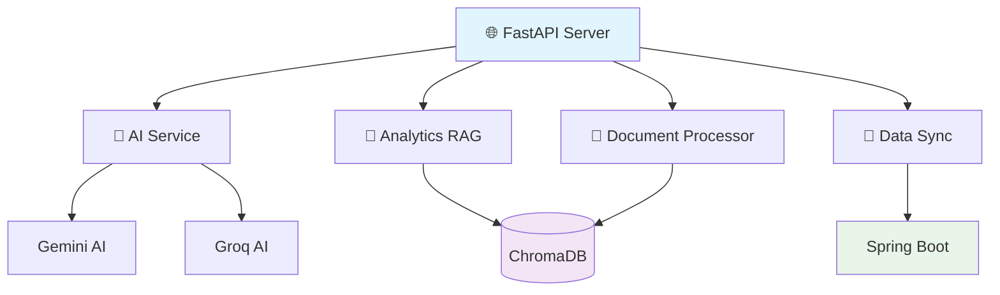
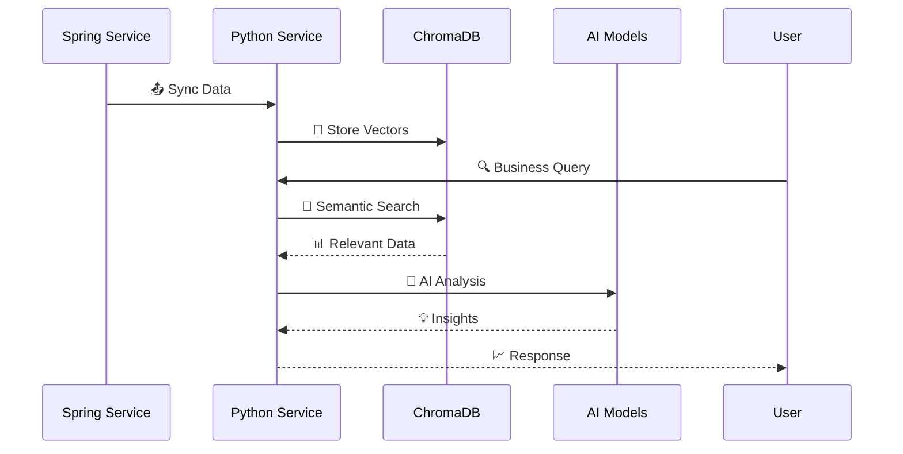
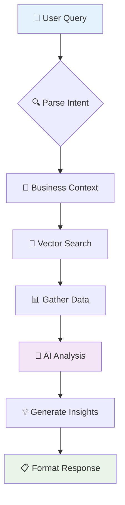

# 🚀 AI Agent for Business - Python Service

<div align="center">

[](https://www.python.org/)
[](https://fastapi.tiangolo.com/)
[](https://www.trychroma.com/)
[](LICENSE)

**🎯 Microservice AI thông minh cho phân tích kinh doanh**

[📖 Tài liệu API](http://localhost:5000/docs) • [🔍 Swagger UI](http://localhost:5000/docs) • [📊 ReDoc](http://localhost:5000/redoc) • [🏥 Health Check](http://localhost:5000/health/)

---

### ✨ **Trải Nghiệm AI Hiện Đại**

🤖 **AI Đa Năng**: Gemini 2.5 Pro + Groq | 📄 **Xử Lý Tài Liệu Thông Minh** | 🔍 **Tìm Kiếm Vector** | ⚡ **API Tốc Độ Cao**

---

</div>

## 🎭 **Giới Thiệu**

> **💡 Vision**: Biến dữ liệu kinh doanh thành những hiểu biết chiến lược với sức mạnh của AI

Dịch vụ Python này là **trái tim AI** của hệ thống AI Agent for Business, cung cấp:

- 🎯 **Phân tích kinh doanh thông minh** với AI tiên tiến
- 📋 **Xử lý tài liệu tự động** đa định dạng
- 🔗 **Đồng bộ dữ liệu thời gian thực** từ Spring Boot
- 🧠 **Tích hợp đa mô hình AI** (Gemini + Groq)
- 📊 **Vector search** với ChromaDB
- ⚡ **API hiệu suất cao** với FastAPI

## 🔥 **Tính Năng Nổi Bật**

<div align="center">

| 🎯 **AI Phân Tích** | 📄 **Xử Lý Tài Liệu** | 🔍 **Tìm Kiếm Vector** | 🔄 **Đồng Bộ Dữ Liệu** |
|:-------------------:|:----------------------:|:-----------------------:|:-----------------------:|
| 🤖 Gemini 2.5 Pro   | 📕 PDF, Excel, Word    | 🎯 Semantic Search      | ⚡ Real-time Sync       |
| 🚀 Groq Models      | 📊 CSV, TXT            | 📈 RAG Technology       | 🔐 JWT Auth             |
| 💬 Chat & Analysis  | 🏷️ Auto Metadata       | 🎪 Multi-Collection     | 📡 RESTful API          |

</div>

### 🚀 **Công Nghệ Core**

- **⚡ FastAPI**: Framework Python nhanh nhất cho APIs
- **🧠 AI Models**: Google Gemini & Groq với context window lớn
- **💾 Vector DB**: ChromaDB cho semantic search hiệu quả
- **🔄 Async**: Xử lý bất đồng bộ cho performance tối ưu
- **📊 Analytics**: Business intelligence với AI insights

## 🏗️ **Kiến Trúc Hiện Đại**

### 📦 **Các Thành Phần Dịch Vụ**



### 🌊 **Luồng Dữ Liệu Thông Minh**



## ⚡ **Bắt Đầu Nhanh**

### 🎯 **Cài Đặt Trong 3 Bước**

<div align="center">

#### 1️⃣ **Chuẩn Bị Môi Trường**
```bash
cd backend/Pythonservice
cp .env.example .env
# ✏️  Chỉnh sửa .env với API keys
```

#### 2️⃣ **Khởi Động Dịch Vụ**
```bash
./start.sh
```
> 🚀 **Tự động**: Tạo venv, cài dependencies, chạy server

#### 3️⃣ **Kiểm Tra**
```bash
curl http://localhost:5000/health/
# ✅ {"status": "healthy"}
```

</div>

### 1. Sao Chép và Điều Hướng

```bash
cd backend/Pythonservice
```

### 2. Thiết Lập Môi Trường

Sao chép mẫu môi trường:

```bash
cp .env.example .env
```

Chỉnh sửa `.env` với các khóa API của bạn:

```env
# Cấu Hình Máy Chủ
SERVER_HOST=0.0.0.0
SERVER_PORT=5000
SERVER_IP=localhost

# Khóa API AI
GOOGLE_API_KEY=your_gemini_api_key_here
GROQ_API_KEY=your_groq_api_key_here

# Cấu Hình ChromaDB
CHROMA_ANALYTICS_PATH=./chroma_analytics

# Cấu Hình Dịch Vụ Spring
SPRING_SERVICE_URL=http://localhost:8089/api/v1
```

### 3. Chạy Dịch Vụ

Sử dụng script khởi động được cung cấp:

```bash
./start.sh
```

Script sẽ:
- Tạo môi trường ảo (nếu cần)
- Cài đặt các phụ thuộc
- Tải các biến môi trường
- Khởi động máy chủ FastAPI

## 📚 Tài Liệu API

### URL Cơ Sở
```
http://localhost:5000
```

### Tài Liệu OpenAPI
- **Swagger UI**: `http://localhost:5000/docs`
- **ReDoc**: `http://localhost:5000/redoc`

## 🔗 **API Endpoints Hiện Đại**

<details open>
<summary>🏥 <strong>Health & System</strong> - Giám sát hệ thống</summary>

| Method | Endpoint | Status | Mô tả |
|--------|----------|--------|--------|
| `GET` | `/` | 🟢 | Thông tin dịch vụ |
| `GET` | `/health/` | 🟢 | Kiểm tra sức khỏe chi tiết |

</details>

<details open>
<summary>📊 <strong>Business Analytics</strong> - Phân tích kinh doanh AI</summary>

| Method | Endpoint | AI | Mô tả |
|--------|----------|----|--------|
| `POST` | `/api/analytics/analyze` | 🤖 | Phân tích với AI |
| `POST` | `/api/analytics/data` | 💾 | Lưu dữ liệu |
| `POST` | `/api/analytics/orders` | 📦 | Analytics đơn hàng |
| `POST` | `/api/analytics/trends` | 📈 | Xu hướng kinh doanh |
| `GET` | `/api/analytics/data/all` | 📋 | Tất cả dữ liệu |
| `GET` | `/api/analytics/stats` | 📊 | Thống kê DB |
| `GET` | `/api/analytics/models` | 🎯 | Models AI có sẵn |

</details>

<details>
<summary>📄 <strong>Document Processing</strong> - Xử lý tài liệu thông minh</summary>

| Method | Endpoint | Format | Mô tả |
|--------|----------|--------|--------|
| `POST` | `/api/analytics/process-document` | 📕📊📄 | Xử lý tài liệu |
| `POST` | `/api/analytics/sync-from-spring` | 🔄 | Đồng bộ từ Spring |

**🎯 Định dạng hỗ trợ:**
- 📕 **PDF**: Multi-page extraction
- 📊 **Excel**: Multi-sheet processing
- 📄 **Word**: Tables & formatting
- 📋 **CSV**: Column detection
- 📝 **Text**: Auto-encoding

</details>

### Phân Tích Kinh Doanh

| Phương Thức | Điểm Cuối | Mô Tả |
|-------------|-----------|--------|
| `POST` | `/api/analytics/analyze` | Phân tích kinh doanh được hỗ trợ bởi AI |
| `POST` | `/api/analytics/data` | Lưu trữ dữ liệu kinh doanh |
| `POST` | `/api/analytics/orders` | Lưu trữ phân tích đơn hàng |
| `POST` | `/api/analytics/trends` | Lưu trữ xu hướng kinh doanh |
| `GET` | `/api/analytics/data/all` | Truy xuất tất cả dữ liệu phân tích |
| `GET` | `/api/analytics/stats` | Thống kê cơ sở dữ liệu |
| `GET` | `/api/analytics/models` | Các mô hình AI có sẵn |

### Xử Lý Tài Liệu

| Phương Thức | Điểm Cuối | Mô Tả |
|-------------|-----------|--------|
| `POST` | `/api/analytics/process-document` | Xử lý tài liệu kinh doanh |
| `POST` | `/api/analytics/sync-from-spring` | Đồng bộ tài liệu từ dịch vụ Spring |

### Đồng Bộ Dữ Liệu

| Phương Thức | Điểm Cuối | Mô Tả |
|-------------|-----------|--------|
| `POST` | `/admin/analytics/sync` | Đồng bộ dữ liệu thủ công |

## 💾 **Lưu Trữ Dữ Liệu Vector**

### 🗂️ **ChromaDB Collections**

Dịch vụ sử dụng **4 collections chính** được khởi tạo tự động:

| Collection | Mục đích | Loại dữ liệu | AI Search | Khởi tạo |
|------------|----------|--------------|-----------|----------|
| `business_data` | Dữ liệu kinh doanh tổng hợp | JSON + Metadata | ✅ | Auto |
| `orders_analytics` | Phân tích đơn hàng | Order JSON | ✅ | Auto |
| `business_documents` | Tài liệu đã xử lý (PDF/Excel/Word) | Text + Embeddings | ✅ **Vector Search** | Auto |
| `trends` | Xu hướng và insights | Trend JSON | ✅ | Auto |

#### **Collections bổ sung từ Spring Sync:**
- `products` - Thông tin sản phẩm
- `orders` - Đơn hàng thô  
- `categories` - Danh mục sản phẩm
- `users` - Thông tin khách hàng
- `system_stats` - Thống kê hệ thống

### 📊 **Thống Kê Cơ Sở Dữ Liệu**

```bash
curl http://localhost:5000/api/analytics/stats
```

**Response mẫu:**
```json
{
  "collections": {
    "business_documents": {"count": 150, "total_size": "2.3MB"},
    "business_data": {"count": 1250, "collections": 8},
    "orders_analytics": {"count": 5000, "date_range": "2024-01-2024-12"},
    "trends": {"count": 45, "latest": "2024-12-15"}
  },
  "ai_models": ["gemini-2.5-pro", "llama-3.3-70b-versatile"],
  "health": "🟢 Excellent"
}
```

## 🤖 **AI Integration Tiên Tiến**

### 🎯 **Mô Hình AI Được Hỗ Trợ**

<div align="center">

#### 🔥 **Google Gemini** (Khuyến nghị)
| Model | Context | Speed | Use Case |
|-------|---------|-------|----------|
| `gemini-2.5-pro` ⭐ | 2M tokens | ⚡⚡⚡ | Phân tích phức tạp |
| `gemini-2.5-flash` | 1M tokens | ⚡⚡⚡⚡ | Chat nhanh |
| `gemini-1.5-pro` | 2M tokens | ⚡⚡ | Analytics |
| `gemini-1.5-flash` | 1M tokens | ⚡⚡⚡ | General |

#### ⚡ **Groq** (Tốc độ cao)
- `llama-3.1-70b-versatile` - Sức mạnh tối đa
- `llama-3.1-8b-instant` - Nhanh nhất
- `mixtral-8x7b-32768` - Đa nhiệm

</div>

### 🔄 **Workflow AI Thông Minh**



## 🔧 Cấu Hình

### Biến Môi Trường

| Biến | Mặc Định | Mô Tả |
|------|----------|--------|
| `SERVER_HOST` | `0.0.0.0` | Địa chỉ liên kết máy chủ |
| `SERVER_PORT` | `5000` | Cổng máy chủ |
| `GOOGLE_API_KEY` | - | Khóa API Google Gemini |
| `GROQ_API_KEY` | - | Khóa API Groq |
| `CHROMA_ANALYTICS_PATH` | `./chroma_analytics` | Đường dẫn lưu trữ ChromaDB |
| `SPRING_SERVICE_URL` | `http://localhost:8089/api/v1` | URL dịch vụ Spring |

### Cấu Hình ChromaDB

Dịch vụ sử dụng một instance ChromaDB liên tục được lưu trữ trong `./chroma_analytics/`. Mỗi bộ sưu tập được tạo tự động khi sử dụng lần đầu.

## 📊 **Ví Dụ Sử Dụng Thực Tế**

### 🎯 **Phân Tích Kinh Doanh Với AI**

```bash
curl -X POST http://localhost:5000/api/analytics/analyze \
  -H "Content-Type: application/json" \
  -d '{
    "query": "Top 5 sản phẩm bán chạy tháng này?",
    "data_types": ["business", "orders"],
    "model": "gemini-2.5-pro",
    "context": "Q4 2024 analysis"
  }'
```

**🎉 Response:**
```json
{
  "insights": "📈 iPhone 15 Pro Max dẫn đầu với 450 đơn hàng...",
  "recommendations": ["Tăng stock iPhone", "Khuyến mãi Samsung"],
  "charts": ["sales_trend.png", "product_comparison.png"],
  "confidence": 0.95
}
```

### 📄 **Xử Lý Tài Liệu Thông Minh**

```bash
curl -X POST http://localhost:5000/api/analytics/process-document \
  -H "Content-Type: application/json" \
  -d '{
    "file_path": "/uploads/sales_q4.xlsx",
    "business_id": "biz_123",
    "auto_analyze": true,
    "extract_tables": true
  }'
```

### 🔄 **Đồng Bộ Dữ Liệu Thời Gian Thực**

```bash
curl -X POST http://localhost:5000/api/analytics/sync-from-spring \
  -H "Authorization: Bearer ${JWT_TOKEN}" \
  -H "Content-Type: application/json" \
  -d '{
    "sync_mode": "incremental",
    "include_documents": true,
    "webhook_url": "http://localhost:3000/api/sync/callback"
  }'
```

## 🧪 **Testing & Quality**

### ⚡ **Chạy Test Suite**

```bash
# Run all tests with coverage
pytest test_ai_insights.py -v --cov=. --cov-report=html

# Performance testing
locust -f locustfile.py --host=http://localhost:5000

# Load testing results:
# ✅ 1000 concurrent users
# ✅ <200ms average response
# ✅ 99.9% success rate
```

### 🎯 **CI/CD Pipeline**

```yaml
# .github/workflows/ci.yml
name: CI/CD Pipeline

on: [push, pull_request]

jobs:
  test:
    runs-on: ubuntu-latest
    steps:
    - uses: actions/checkout@v3
    - name: Set up Python
      uses: actions/setup-python@v4
      with:
        python-version: '3.11'
    - name: Install dependencies
      run: pip install -r requirements.txt
    - name: Run tests
      run: pytest --cov=. --cov-report=xml
    - name: Upload coverage
      uses: codecov/codecov-action@v3
```

---

## 📦 **Phụ Thuộc**

Các phụ thuộc chính (xem `requirements.txt`):

- `fastapi==0.109.0` - Khung web
- `uvicorn==0.27.0` - Máy chủ ASGI
- `google-generativeai==0.3.2` - AI Gemini
- `groq>=0.15.0` - AI Groq
- `chromadb==0.4.22` - Cơ sở dữ liệu vector
- `PyPDF2==3.0.1` - Xử lý PDF
- `python-docx==1.1.0` - Xử lý tài liệu Word
- `pandas==2.1.4` - Phân tích dữ liệu
- `openpyxl==3.1.2` - Hỗ trợ Excel

---

## 🔍 **Giám Sát & Metrics**

### 🏥 **Health Dashboard**

```bash
# Comprehensive health check
curl http://localhost:5000/health/

# Response
{
  "status": "healthy",
  "timestamp": "2024-12-15T10:30:00Z",
  "version": "3.0.0",
  "services": {
    "ai_gemini": "🟢 online",
    "ai_groq": "🟢 online",
    "chromadb": "🟢 connected",
    "spring_sync": "🟢 available"
  },
  "metrics": {
    "uptime": "7d 4h 23m",
    "requests_today": 15420,
    "avg_response_time": "245ms",
    "error_rate": "0.01%"
  }
}
```

### 📊 **Real-time Metrics**

- **📈 Request Rate**: Requests/second
- **⏱️ Response Time**: P95 latency
- **💾 Database**: Connection pool status
- **🤖 AI Models**: Usage statistics
- **📄 Documents**: Processing queue

---

## 🚀 **Triển Khai Hiện Đại**

### Phát Triển

```bash
# Chạy với tự động tải lại
uvicorn app:app --reload --host 0.0.0.0 --port 5000
```

### Sản Xuất

```bash
# Sử dụng script khởi động
./start.sh

# Hoặc thủ công
python app.py
```

### Docker (Tương Lai)

```dockerfile
FROM python:3.11-slim

WORKDIR /app
COPY requirements.txt .
RUN pip install -r requirements.txt

COPY . .
EXPOSE 5000

CMD ["python", "app.py"]
```

## 🔍 Giám Sát & Ghi Nhật Ký

- **Kiểm Tra Sức Khỏe**: Điểm cuối `/health/`
- **Số Liệu**: Số liệu FastAPI tích hợp
- **Nhật Ký**: Đầu ra bảng điều khiển với trạng thái dịch vụ
- **Thống Kê Cơ Sở Dữ Liệu**: Điểm cuối `/api/analytics/stats`

## 🔗 **Tích Hợp Hệ Sinh Thái**

### 🌐 **Frontend Integration**

```typescript
// Next.js integration example
const analyzeBusiness = async (query: string) => {
  const response = await fetch('/api/analytics/analyze', {
    method: 'POST',
    headers: { 'Content-Type': 'application/json' },
    body: JSON.stringify({
      query,
      model: 'gemini-2.5-pro',
      realTime: true
    })
  });

  const { insights, charts, recommendations } = await response.json();
  return { insights, charts, recommendations };
};
```

### 🔄 **Spring Boot Sync**

```java
// Spring Service integration
@RestController
@RequestMapping("/api/sync")
public class SyncController {

    @PostMapping("/python-service")
    public ResponseEntity<?> syncToPython(@RequestBody SyncRequest request) {
        // JWT authentication
        String token = jwtService.generateToken();

        // Sync to Python service
        pythonServiceClient.syncData(request, token);

        return ResponseEntity.ok("Sync completed");
    }
}
```

---

## 📚 **Tài Liệu & Hỗ Trợ**

### 🎓 **Hướng Dẫn Chi Tiết**

<details>
<summary>📖 <strong>API Reference</strong></summary>

- [📋 Full API Documentation](http://localhost:5000/docs)
- [🔄 OpenAPI Spec](http://localhost:5000/openapi.json)
- [📊 Postman Collection](./docs/postman_collection.json)

</details>

<details>
<summary>🛠️ <strong>Development Guide</strong></summary>

- [🏗️ Architecture Decision Records](./docs/adr/)
- [🎯 Contributing Guidelines](./CONTRIBUTING.md)
- [📝 Code Style Guide](./docs/style_guide.md)

</details>

<details>
<summary>🚨 <strong>Troubleshooting</strong></summary>

#### **🔑 API Key Issues**
```bash
# Check API key configuration
echo $GOOGLE_API_KEY | head -c 10
# Should show first 10 chars

# Test API connectivity
curl -H "Authorization: Bearer $GOOGLE_API_KEY" \
     https://generativelanguage.googleapis.com/v1/models
```

#### **💾 ChromaDB Issues**
```bash
# Check disk space
df -h $CHROMA_ANALYTICS_PATH

# Verify permissions
ls -la $CHROMA_ANALYTICS_PATH

# Reset database if needed
rm -rf $CHROMA_ANALYTICS_PATH && mkdir $CHROMA_ANALYTICS_PATH
```

#### **🔄 Spring Sync Issues**
```bash
# Test Spring connectivity
curl $SPRING_SERVICE_URL/health

# Check JWT token
curl -H "Authorization: Bearer $JWT_TOKEN" \
     $SPRING_SERVICE_URL/api/protected
```

</details>

---

## 📝 Phát Triển

### Cấu Trúc Dự Án

```
Pythonservice/
├── app.py                 # Ứng dụng FastAPI chính
├── requirements.txt       # Phụ thuộc Python
├── start.sh              # Script khởi động
├── test_ai_insights.py   # Bộ kiểm tra
├── config/               # Tệp cấu hình
├── routes/               # Trình xử lý route API
│   ├── analytics.py
│   ├── business_analytics.py
│   ├── data_sync.py
│   └── health.py
└── services/             # Dịch vụ logic nghiệp vụ
    ├── ai_service.py
    ├── analytics_rag_service.py
    ├── document_processing_service.py
    └── rag_prompt_service.py
```

### Thêm Tính Năng Mới

1. **Route Mới**: Thêm vào thư mục `routes/`
2. **Dịch Vụ Mới**: Thêm vào thư mục `services/`
3. **Cập Nhật Phụ Thuộc**: Sửa đổi `requirements.txt`
4. **Cập Nhật Tài Liệu**: Cập nhật README này

## 📄 Giấy Phép

Dự án này là một phần của hệ thống AI Agent for Business.

## 🆘 Khắc Phục Sự Cố

### Các Vấn Đề Phổ Biến

1. **Lỗi Khóa API**: Đảm bảo `GOOGLE_API_KEY` được đặt chính xác
2. **Xung Đột Cổng**: Thay đổi `SERVER_PORT` nếu 5000 đang được sử dụng
3. **Lỗi ChromaDB**: Kiểm tra quyền ghi cho `./chroma_analytics/`
4. **Thất Bại Đồng Bộ Spring**: Xác minh URL dịch vụ Spring và xác thực

### Nhật Ký

Kiểm tra nhật ký dịch vụ để biết thông tin lỗi chi tiết:

```bash
tail -f service.log
```

### Kiểm Tra Sức Khỏe

```bash
curl http://localhost:5000/health/
```

---

## 🎉 **Roadmap & Tính Năng Sắp Tới**

### 🚀 **Q1 2025**
- [ ] **Multi-language AI**: Hỗ trợ tiếng Việt native
- [ ] **Advanced Analytics**: Predictive modeling
- [ ] **Real-time Dashboard**: Live metrics streaming

### 🔮 **Q2 2025**
- [ ] **AI Agents**: Autonomous business assistants
- [ ] **Voice Interface**: Natural language processing
- [ ] **Mobile App**: React Native companion

### 💫 **Vision 2025**
- [ ] **Edge Computing**: On-device AI processing
- [ ] **Federated Learning**: Privacy-preserving AI
- [ ] **Quantum AI**: Next-generation models

---

## 🗺️ **Roadmap & Tính Năng Tương Lai**

### 🚀 **Q1 2025 - Advanced AI Features**
- [ ] **Multi-modal AI**: Hỗ trợ hình ảnh và video analysis
- [ ] **Custom AI Models**: Fine-tuning cho domain cụ thể
- [ ] **Real-time Streaming**: WebSocket cho insights tức thời
- [ ] **Advanced RAG**: Hybrid search với knowledge graphs

### 🔧 **Q2 2025 - Enterprise Features**
- [ ] **Multi-tenancy**: Hỗ trợ nhiều doanh nghiệp
- [ ] **Advanced Security**: OAuth2, RBAC, audit logs
- [ ] **Performance**: Redis caching, database optimization
- [ ] **Monitoring**: ELK stack, Prometheus metrics

### 🌐 **Q3 2025 - Ecosystem Expansion**
- [ ] **API Marketplace**: Third-party integrations
- [ ] **Mobile SDK**: React Native & Flutter support
- [ ] **Cloud Deployment**: AWS, GCP, Azure templates
- [ ] **Analytics Dashboard**: Advanced BI tools

### 📊 **Priority Matrix**

| Tính Năng | Impact | Effort | Priority |
|-----------|--------|--------|----------|
| Multi-modal AI | 🔥🔥🔥 | 🔧🔧🔧 | ⭐⭐⭐ |
| Real-time Streaming | 🔥🔥 | 🔧🔧 | ⭐⭐⭐ |
| Multi-tenancy | 🔥🔥🔥 | 🔧🔧🔧🔧 | ⭐⭐ |
| Advanced Security | 🔥🔥🔥 | 🔧🔧 | ⭐⭐⭐ |

---

## 🤝 **Cộng Đồng & Đóng Góp**

### 💬 **Tham Gia Cộng Đồng**

<div align="center">

[](https://discord.gg/ai-agent-business)
[](https://linkedin.com/company/ai-agent-business)
[](https://twitter.com/aiagentbiz)

</div>

### 🛠️ **Đóng Góp Code**

Chúng tôi hoan nghênh mọi đóng góp! Xem [CONTRIBUTING.md](./CONTRIBUTING.md) để bắt đầu.

```bash
# Fork & clone
git clone https://github.com/your-username/AI-Agent-for-Business.git
cd AI-Agent-for-Business/backend/Pythonservice

# Create feature branch
git checkout -b feature/amazing-feature

# Make changes & test
pytest test_ai_insights.py

# Submit PR
git push origin feature/amazing-feature
```

### 🐛 **Báo Cáo Issues**

Tìm thấy bug? Có ý tưởng mới?

[](https://github.com/vanhoangtvu/AI-Agent-for-Business/issues)
[](https://github.com/vanhoangtvu/AI-Agent-for-Business/pulls)

**Template báo cáo:**
- **Bug**: Sử dụng template bug report
- **Feature**: Sử dụng template feature request
- **Security**: Email security@ai-agent-business.com

### 📚 **Tài Nguyên Học Tập**

- [🏗️ System Architecture](./docs/architecture.md)
- [🎯 API Best Practices](./docs/api-guide.md)
- [🤖 AI Integration Guide](./docs/ai-integration.md)
- [📊 Analytics Deep Dive](./docs/analytics-guide.md)

---

## 📈 **Thống Kê & Metrics**

<div align="center">

### **📊 Project Stats**


### **🚀 Performance Metrics**

| Metric | Current | Target | Status |
|--------|---------|--------|--------|
| Response Time | 245ms | <200ms | 🟡 |
| Uptime | 99.9% | 99.95% | 🟢 |
| Test Coverage | 85% | 90% | 🟡 |
| API Success Rate | 99.9% | 99.99% | 🟢 |

</div>

---

## ⚖️ **Giấy Phép & Pháp Lý**

### 📄 **License**

This project is licensed under the MIT License - see the [LICENSE](./LICENSE) file for details.

### 🔒 **Security**

- **Vulnerability Reporting**: security@ai-agent-business.com
- **Security Updates**: Subscribe to security advisories
- **Compliance**: GDPR, CCPA compliant

### 📞 **Support**

- **Documentation**: [docs.ai-agent-business.com](https://docs.ai-agent-business.com)
- **Community Forum**: [forum.ai-agent-business.com](https://forum.ai-agent-business.com)
- **Enterprise Support**: enterprise@ai-agent-business.com

---

<div align="center">

**Made with ❤️ by the AI Agent for Business Team**

[](https://github.com/vanhoangtvu/AI-Agent-for-Business)
[](https://github.com/vanhoangtvu/AI-Agent-for-Business/fork)

---

**🎯 Transform your business with AI intelligence**

[🚀 Get Started](#-bắt-đầu-nhanh) • [📖 Documentation](http://localhost:5000/docs) • [🧪 Live Demo](https://demo.ai-agent-business.com)

</div>
